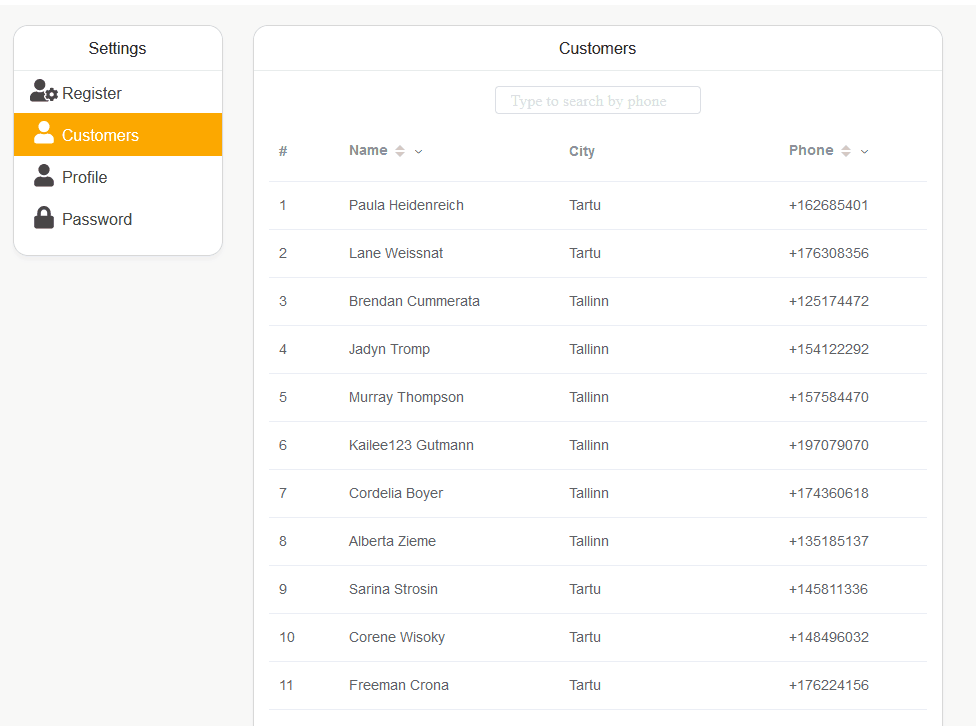

#Тестовое задание для Full Stack Developer
---
Основной твоей обязанностью будет разработка web приложений  для наших партнеров.
Фронтовая часть написана на VueJS. На бекенде - Laravel.

В рамках тестового задание мы предлагаем тебе реализовать простое SPA приложение.

Пример:

От тебя требyется:
- Подготовить простой макет  (возможно использоване Vue UI Library);
- Написать фронтенд на Vue-стеке;
- Поднять веб-сервер на Laravel, который будет отдавать нужные данные на фронт.
- Залить результат на Git репозиторий и подготовить демо ссылку на готовый результат (например [тут](https://heroku.com) )

Что должно делать приложение:
- Выводить список из 30 пользователей `Table Users - id,firstname,lastname,address,phone,email,...` 
- Иметь возможность сортировки и выбора по значению `firstname + lastname` и поиска по полю `phone`
- Иметь возможность внести изменения у выбраного пользователя во все необходимые поля.